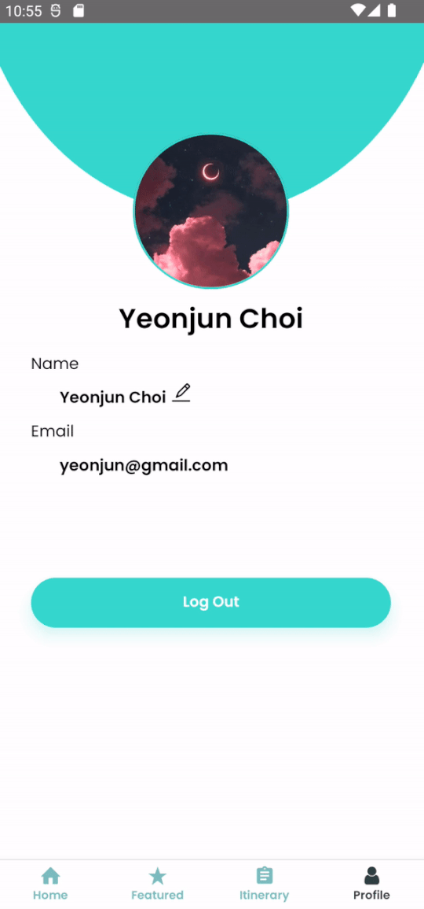

# Introduction

**Travel Log** is a mobile application built to assist users in making their travel itinerary. It is a **React Native** application with **Firebase** to provide a non-SQL database. This application also utilizes **Google Maps API** to show recommendations on where to go during your vacation trips.

This project is made for **ERC11PM's CP2106 Project (Apollo Level)** in the National University of Singapore. Our team consists of <a href="https://github.com/melissaharijanto">Melissa Anastasia Harijanto</a> and <a href="https://github.com/liviamil">Livia Michelle Iskandar Leo</a>. 




## Table of Contents
- [Motivation](#motivation)
- [User Stories](#user-stories)
- [Aim](#aim)
- [Features](#features)
- [Initial Design Prototype](#initial-design-prototype)
- [Testing Methods](#testing-methods)
- [Installation](#installation)

## Motivation
As avid travelers, we believe that planning your own trips would bring more freedom and flexibility in travelling as opposed to hopping in on tours. However, planning our own trip comes with a lot of hassle. Compounded with the lack of a proper trip-planning platform (opting for notes/google docs with limited planning features), detailing an itinerary might deter one’s enthusiasm of travelling.

## User Stories
1. As an avid traveler, I would like to be able to be flexible with planning my travel itinerary down to each activity, accommodation, and transport details so that I won’t waste any time.
2. As a first-time traveler, I would like to be guided on making a detailed travel itinerary.
3. As first-time travelers, we would find it easier to be guided in making my travel plans and have a place to store all the necessary documents in one place so that we won't forget them.

## Aim
We hope to provide a one-stop application that would not only ease, but also encourage people to plan their own travels – solo or in a group. Users could easily add their planned activities, transport, and accommodation by our built-in functions that guides them in filling in their travel details. We hope that users could spend less time making a visual, detailed travel itinerary.

## Features
1. User authentication - sign up, log in and resetting your account password via a password reset email.
2. Setting up your own profile by changing your profile picture and setting up your display name.
3. Creating new itineraries and accessing/editing previous ones that have been made.
4. Automatically generate tabs for separate days upon creating a new itinerary.
5. Automatically sort each day's activities based on the time that is inputted upon adding new activities.
6. Editing the details of the itinerary, accommodation, activities and transport. 
7. Need references? Out of ideas on where to go? Access another person's itinerary by entering the itinerary's unique code (view-only).
8. Have too many itineraries? Search your itineraries based on their titles!
9. View recommendations and recommended itineraries from the app.
10. Set the location for your accommodations via Google Maps.

To view the features of each page, please refer to <a href="https://docs.google.com/document/d/1Rbl5xvDYa3nckiapXDep-_QBE1GBdg1VTyXYMsfY-6E/edit?usp=sharing"> this document</a>.

## Initial Design Prototype
<iframe style="border: 1px solid rgba(0, 0, 0, 0.1);" width="800" height="450" src="https://www.figma.com/embed?embed_host=share&url=https%3A%2F%2Fwww.figma.com%2Ffile%2FCKGloIToiN5VlPJoaYpxCx%2FTravel-Log---Clean%3Fnode-id%3D0%253A1" allowfullscreen></iframe>

## Testing methods
We used **React Native Testing Library** and **Jest** to test the components (Unit Testing). To run the test cases, run `npm test` on the root directory of the project.

Due to a few errors, we are not able to implement Integration Testing with the testing library (NativeEventError due to some packages used), so we decided to implement **user testing** by distributing our apk to 10 people (mainly university students) and asking them to fill in a form about its functionalities. The form is set to anonymous in an attempt to maintain objectivity of the responses. The results of the form can be seen <a href="https://docs.google.com/spreadsheets/d/1jWGdPQogBsgr9BT4jBwYNIArUPwaPlW-X3HUOd_Nt8I/edit?usp=sharing">here</a>.

The link to the form can be seen <a href="https://docs.google.com/forms/d/13HqR6ZaJr3cNKarSHqOrV8jqXvz_9OpZRbYv0hLqMGw/viewform?edit_requested=true">here</a>.

## Installation

{: .note-title}
> Important Note
>
> **If you have a previously installed version of the apk, please uninstall it from your device before installing the current updated version.**

We would be happy if you are interested to try it out!

If you have an Android device, we have an apk release that you can use to test our app! Since most phones now use ARM processors, it is recommended to download the apk customized for ARM64, with the file name `app-arm64-v8a-release.apk` via <a href="https://drive.google.com/drive/folders/1bRMKL1-gXEHCNQtm2PtWu83xwtcKCWV4?usp=sharing">this link</a>. 

Otherwise, you can try this way:

1. Please clone the repository to your local device by running this command.
```
git clone https://github.com/melissaharijanto/Travel-Log.git
```
If you have previously cloned the repository to your local device (from previous milestones), please run this
command instead. 
```
cd Travel-Log
git pull
npm install // to install the required dependencies of the project.
```
2. The app is customized for android and uses React Native CLI. If you do not have it set up yet, please refer to <a href="https://reactnative.dev/docs/environment-setup">this link</a> to set it up.

Please use the following commands in your terminal:
```
cd Travel-Log // go to the root directory of the project, if you're not in there yet.
npm install // to install the required dependencies of the project.
npm start
npx react-native run-android
```
to run the app.

Otherwise, if you have an Android device and would like to try it there instead of an emulator, you can do this instead.
- Go to Settings > About phone > Software information and tap on your Build number 7 times.
- Developer options will be enabled; go back to Settings > Developer options and enable 'USB Debugging'.
- To confirm whether your device has been connected or not, run 
```
adb devices
```
in your terminal. 
- Run the app by running 
```
npx react-native run-android
```
For more information on this method, please visit <a href="https://reactnative.dev/docs/running-on-device">React's official documentation</a>.

3. Have fun navigating through! If you face any troubles, please contact us through our Telegram handles:  @livmichelle / @melissaharijanto.
You can sign in with our placeholder account to try the app's features:
- Email: yeonjun@gmail.com
- Password: 300500

Or alternatively, if you want to test the 'Forget Password' function, please sign up with a new account with your
**real** email, as it will be sent via a password-reset email!
