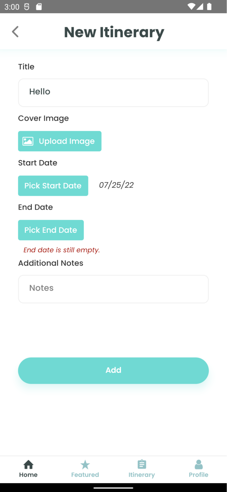
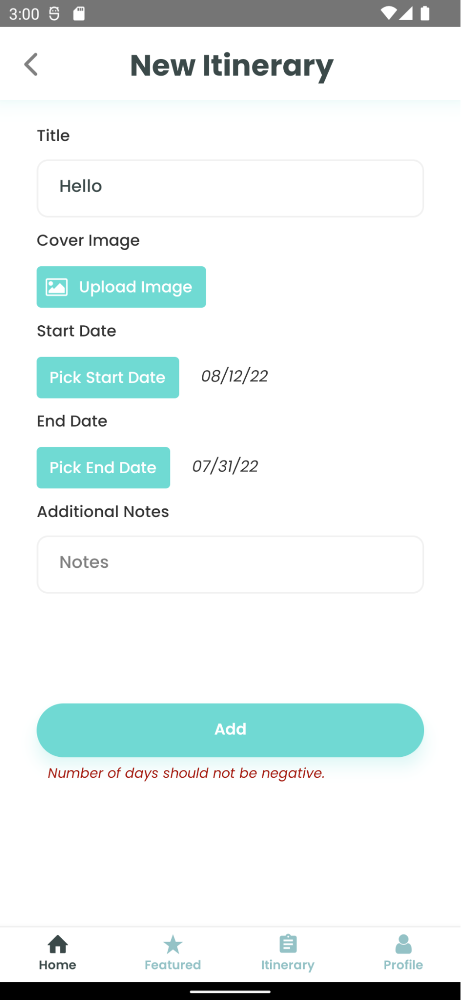
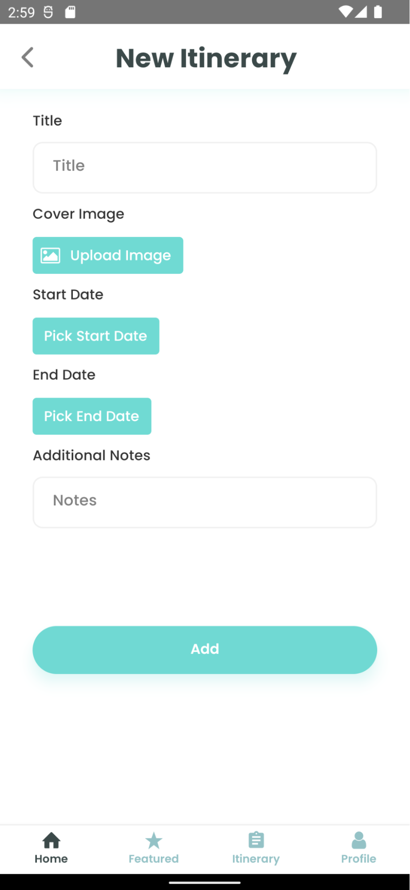
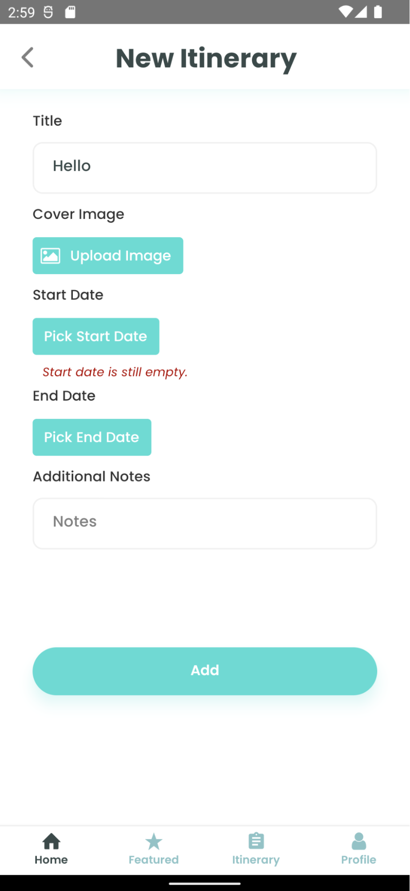

# Creating a New Itinerary

- After pressing the `+ New Itinerary` button on the home page, you will be redirected to this page.
- The title, start date, and end date fields are mandatory; if you leave them empty, the application will remind you to fill them in.
- The cover image and additional notes fields are optional. If you do not upload your cover image, the application will use its default image. The additional notes will be left empty if you do not input anything.
- The optimal ratio for a cover image is **16:9**.
- The start date cannot be later than the end date. *Rationale: A trip cannot start after it ends, can it?*