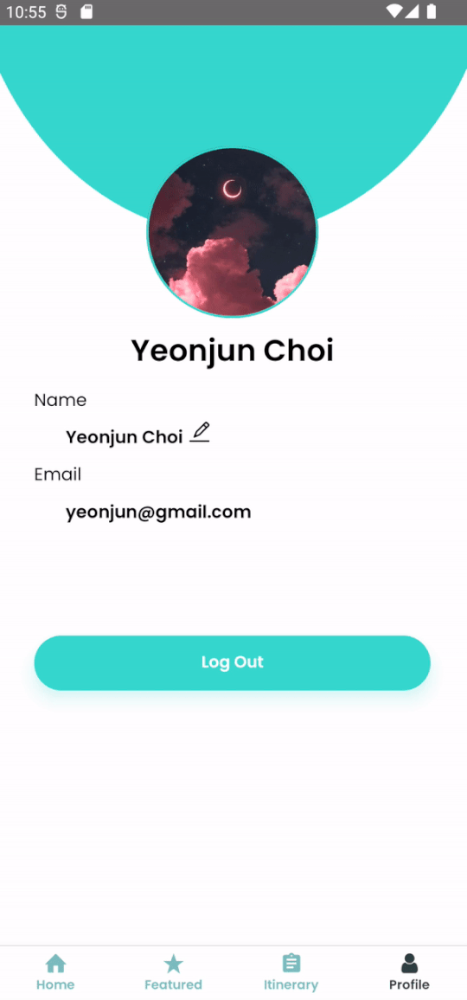

# Customizing Your Profile

#### Features

- To edit your profile, click on the pencil icon beside your name.
- Currently, you are only able to change your **display name** and **profile picture**.
- After changing your details, you can save your changes by clicking `Save changes`. If you wish to abort, click `Cancel` instead.
- In this page, users can also `Log out` of their accounts and be redirected back to the login page.
