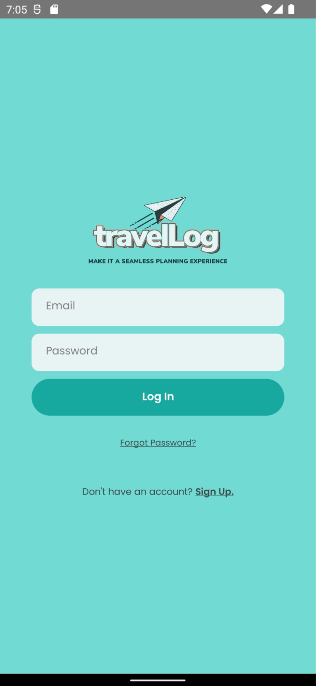
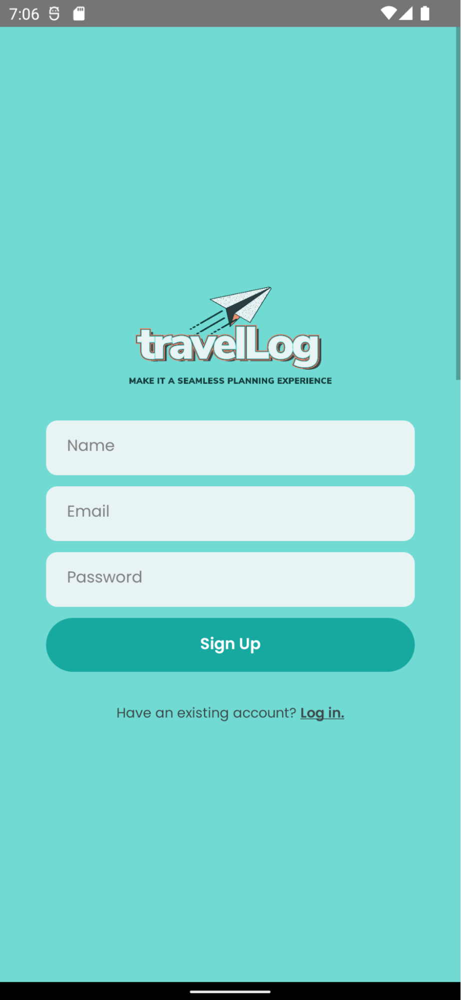
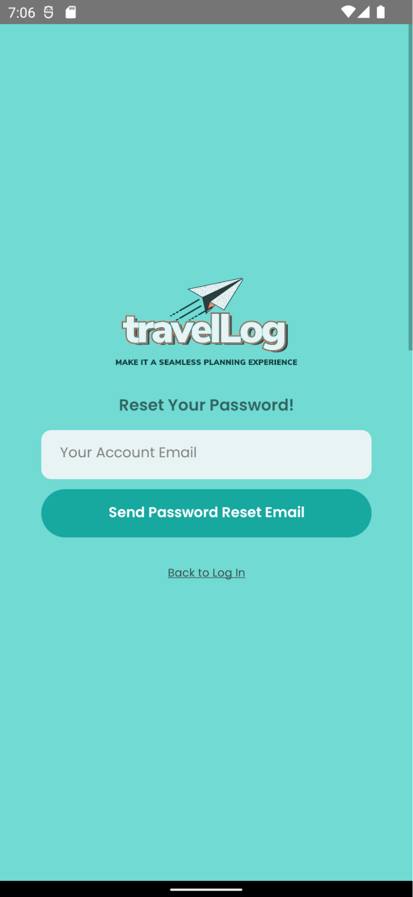

# Log In, Sign Up, Forgot Password

#### Features
- Users can toggle between these three pages.
- When users forget their password, a password-reset email will be sent to the email address linked to the account.
{: .warning-title}
> User Note
>
> If the email is not registered/format is invalid, an error message will show.

{: .note-title }
> Developer Note
>
> Upon logging in or signing up, users will be redirected to another page, which is implemented by a different stack.(For reference of implementation, see the file `index.js` in the <a href="https://github.com/melissaharijanto/Travel-Log/tree/main/src/navigation">navigation</a> folder of the repo.)

