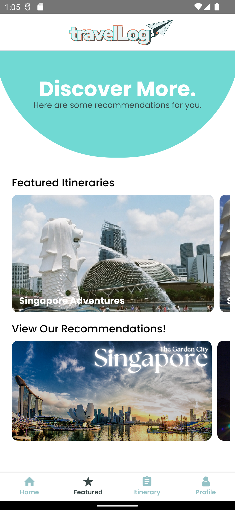

# Viewing Travel Recommendations
{: .no_toc }

To view travel recommendations, you can do so in the `Featured` page, where you can view others' itineraries or view recommendations generated by the application.

## Table of contents
{: .no_toc .text-delta }

- TOC
{:toc}

## Viewing Our Recommendations

 &nbsp;

#### When you press any of the tabs under `View our recommendations`:
{: .no_toc}

- The application categorizes its recommendations to three categories: `Accommodation`, `Restaurants`, `Activities`.
- Each recommendation is given an address as well as a map to show its location (as shown in the gif), as well as ratings and descriptions from its website / Google page.
- Currently, the application only provides recommendations for two locations: `Singapore` and `Surabaya`.

## Viewing Others' Itineraries

 &nbsp;

#### To view others' itineraries, you can either:
{: .no_toc}

- Upon loading, the application will load three random itineraries from its database and show them to you.
- You are only allowed to view the itineraries, but you are not able to edit them.